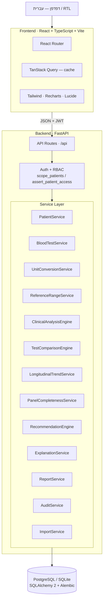
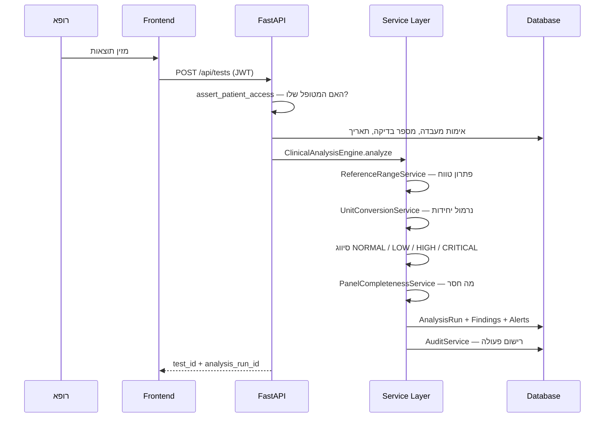
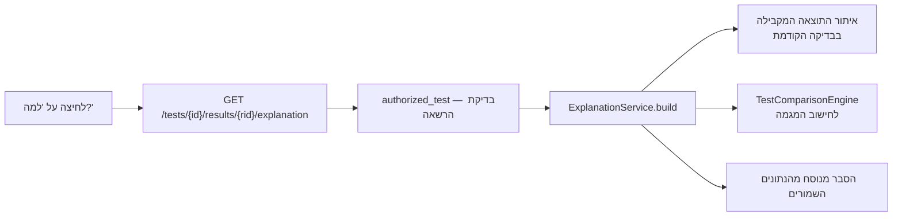

# ארכיטקטורה — HEMORA

## תמונה כללית



## עקרונות

**הלוגיקה העסקית לא יושבת ב-routes.** ה-routes מבצעים אימות, הרשאה ותרגום שגיאות
בלבד; כל החישוב הקליני נמצא ב-`services.py`. כך אפשר לבדוק את המנועים ביחידה
בלי להרים שרת, וזה מה שמאפשר את 32 הבדיקות האוטומטיות.

**נקודת אכיפה אחת להרשאות.** במקום לשכפל תנאי `if role == ...` בכל endpoint,
יש שתי פונקציות ב-`backend/app/api.py`:

| פונקציה | תפקיד |
|---|---|
| `scope_patients(query, user)` | מוסיפה `WHERE` לכל שאילתה שמחזירה מטופלים |
| `assert_patient_access(db, user, patient_id)` | מחזירה את המטופל, או 403 / 404 |

כל endpoint שנוגע במטופל או בבדיקה עובר דרכן. אם בעתיד יתווסף תפקיד חמישי,
משנים מקום אחד.

**סדר הבדיקות חשוב.** ב-`create_test` ההרשאה נבדקת *לפני* אימות הקלט,
כדי שמשתמש בלי הרשאה לא יוכל ללמוד אם מספר בדיקה או מעבדה קיימים.

## זרימת בקשה — הוספת בדיקת דם



## זרימת הסבר — "למה HEMORA מציגה את זה?"



ה-`ExplanationService` לא מחזיק טקסט קבוע לכל מדד. הוא מרכיב את המשפטים
מהערכים שנשמרו בפועל, ולכן ההסבר נשאר נכון גם אם הנתונים או הטווחים ישתנו.

## שכבות ותיקיות

```text
backend/app/
├── main.py         הרכבת האפליקציה, CORS, כותרות אבטחה, טיפול בשגיאות
├── api.py          routes + אכיפת הרשאות
├── management.py   routes לניהול (ADMIN) והתראות
├── services.py     כל המנועים הקליניים
├── reporting.py    יצירת PDF בעברית
├── models.py       טבלאות SQLAlchemy
├── schemas.py      אימות קלט/פלט (Pydantic v2)
├── security.py     Argon2, JWT, הצפנת ת״ז, בדיקת ספרת ביקורת
├── seed.py         נתוני הדגמה
└── database.py     engine + session

frontend/src/
├── App.tsx         מסכים ראשיים + ניווט לפי תפקיד
├── api.ts          שכבת גישה ל-API + ApiError
├── components.tsx  לוגו, StatusBadge, מצבי ריק/שגיאה
├── NewPatient.tsx  יצירת מטופל
├── NewTest.tsx     הזנת בדיקה ידנית
└── Management.tsx  ניהול קטלוג ומרכז התראות
```

## החלטות טכניות

| החלטה | נימוק |
|---|---|
| ניתוח דטרמיניסטי, לא LLM | חובה שיהיה ניתן להסביר ולשחזר כל סיווג קליני |
| גרסאות אלגוריתם (`HEMORA-CLINICAL-1.0.0`) | שינוי כללים בעתיד יישאר עקיב לאחור |
| נרמול יחידות לפני השוואה | השוואה בין יחידות שונות היא שגיאה קלינית |
| `doctor_patients` כרבים־לרבים | מטופל יכול להיות מטופל על ידי יותר מרופא אחד |
| SQLite כברירת מחדל | הרצה מקומית מיידית; docker-compose מריץ PostgreSQL |
| 4xx ללא retry ב-TanStack Query | 403 היא תשובה מכוונת — אין טעם לנסות שוב |
