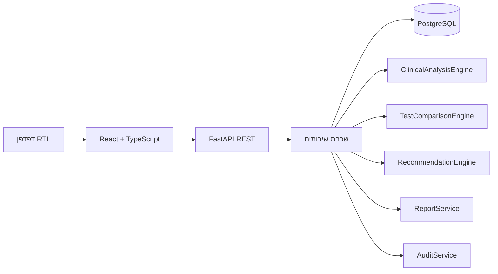

# ארכיטקטורה

```mermaid
flowchart LR
  B[דפדפן RTL] --> F[React + TypeScript]
  F --> A[FastAPI REST]
  A --> S[שכבת שירותים]
  S --> P[(PostgreSQL)]
  S --> C[ClinicalAnalysisEngine]
  S --> X[TestComparisonEngine]
  S --> R[RecommendationEngine]
  S --> D[ReportService]
  S --> U[AuditService]
```

הנתיבים מטפלים ב-HTTP והרשאות בלבד. כללים עסקיים נמצאים בשירותים מבודדים וניתנים לבדיקה. TanStack Query מטפל במטמון בצד הלקוח. Docker Compose מחבר ממשק, API ו-PostgreSQL.
