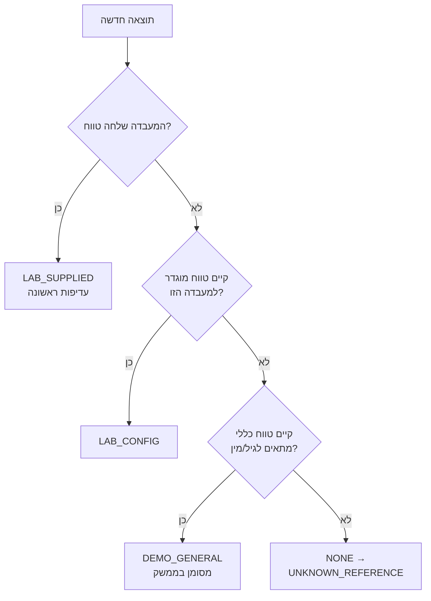
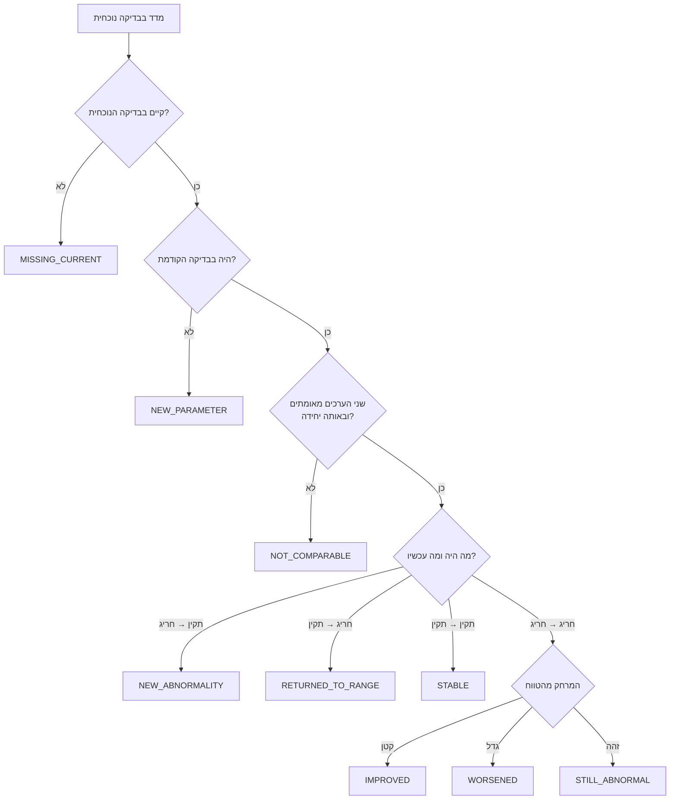

# הלוגיקה הקלינית — HEMORA

גרסת אלגוריתם נוכחית: **`HEMORA-CLINICAL-1.0.0`**
כל ריצת ניתוח נשמרת עם הגרסה שלפיה בוצעה.

## עיקרון היסוד

**הסיווג הקליני דטרמיניסטי ולא נוצר על ידי בינה מלאכותית.**

הסיבה פשוטה: חייב להיות אפשר להסביר ולשחזר כל סיווג. אותם נתונים יביאו תמיד
לאותה תוצאה, וכל ממצא ניתן להצדקה מול טווח מסוים ממקור מסוים. אם בעתיד יתווסף
LLM, מותר לו רק לנסח הסברים בשפה נוחה יותר — **אסור לו לשנות סיווג**.

---

## 1. פתרון טווח הייחוס — `ReferenceRangeService`

אין טווח אחד שמתאים לכל מטופל. הטווח נבחר לפי סדר עדיפויות:

הסינון בטווחים הכלליים לוקח בחשבון מין ביולוגי, גיל בעת הבדיקה, ותוקף
(`valid_from` / `valid_to`).

כאשר נבחר `DEMO_GENERAL`, הממשק חייב להציג:

> "הטווח המוצג הוא טווח ייחוס כללי למטרות מידע בלבד. יש להעדיף את טווח הייחוס
> שסופק על ידי המעבדה המבצעת."

---

## 2. נרמול יחידות — `UnitConversionService`

השוואה בין יחידות שונות היא שגיאה קלינית. השירות מבצע רק המרות דטרמיניסטיות
שהוגדרו במפורש (למשל `mg/dL ↔ mmol/L` עבור גלוקוז, `g/L ↔ g/dL` עבור המוגלובין).

אם אין המרה מאושרת — **המערכת אינה משווה**, ומחזירה:

> "לא ניתן לבצע השוואה מהימנה עקב הבדל ביחידות המדידה."

עדיף להימנע מתשובה מאשר לתת תשובה שגויה.

---

## 3. סיווג — `ClinicalAnalysisEngine.classify`

לפי הסדר הזה בדיוק:

| # | תנאי | תוצאה |
|---|---|---|
| 1 | הנתון אינו מאומת | `UNVERIFIED` |
| 2 | הערך אינו מספר סופי | `INVALID` |
| 3 | מתחת לסף קריטי מוגדר | `CRITICAL_LOW` |
| 4 | מעל סף קריטי מוגדר | `CRITICAL_HIGH` |
| 5 | אין טווח ייחוס | `UNKNOWN_REFERENCE` |
| 6 | מתחת לגבול התחתון | `LOW` |
| 7 | מעל הגבול העליון | `HIGH` |
| 8 | אחרת | `NORMAL` |

בנוסף נשמר `distance_from_range` — המרחק מגבול הטווח הקרוב. הוא מה שמאפשר
לקבוע אחר כך אם ערך "התקרב" או "התרחק".

**ספים קריטיים לעולם אינם מומצאים.** סף נחשב רק אם קיימת רשומה
ב-`critical_thresholds` עם `source_reference` מלא, ליחידת המדידה הנכונה.

---

## 4. השוואה בין בדיקות — `TestComparisonEngine`

זה הלב של המערכת.

**הכלל החשוב ביותר:** המערכת אינה קובעת "השתפר" רק משום שהמספר עלה או ירד.
היא בודקת אם הערך **התקרב או התרחק מטווח הייחוס**.

דוגמה — המוגלובין, גבול תחתון 12:

| קודם | נוכחי | סיווג | ניסוח |
|---|---|---|---|
| 10.8 | 11.7 | `IMPROVED` | "הערך התקרב לטווח אך טרם חזר אליו" |
| 13.5 | 11.0 | `NEW_ABNORMALITY` | "הערך עבר מתוך טווח הייחוס אל מחוץ לו" |
| 11.0 | 12.5 | `RETURNED_TO_RANGE` | "הערך עבר ממצב חריג אל תוך הטווח" |

לכל השוואה נקבעת גם **אמינות**: `HIGH` / `MODERATE` / `LOW` / `NOT_COMPARABLE`,
לפי התאמת יחידות, קיום טווחים ומצב האימות. אמינות אינה ודאות קלינית.

---

## 5. מגמות לאורך זמן — `LongitudinalTrendService`

מחושב מכל הבדיקות של המטופל עבור מדד נתון:

- כיוון כללי (עולה / יורד / יציב)
- מספר תוצאות חריגות ברצף
- מועד החריגה הראשונה
- מועד התוצאה התקינה האחרונה
- תאריכים שהוצאו מהחישוב (בגלל יחידות לא ניתנות להמרה או נתון לא מאומת)

**המערכת אינה מנבאת התפתחות מחלה.** התיאור הוא של מה שקרה בפועל בלבד.

---

## 6. שלמות פאנל — `PanelCompletenessService`

מבדיל בין מדד שלא נמדד לבין תוצאה חריגה.

> **חוסר בנתונים אינו נתון חריג.**

בדיקת CBC ללא HGB לא תניב "יש לחזור על הבדיקה", אלא:

> "בדיקת CBC שהוזנה אינה כוללת ערך HGB. ייתכן שהערך לא הועבר למערכת, לא נמדד
> או שלא נכלל בדוח שהוזן. מומלץ לבדוק את דוח המעבדה המקורי."

---

## 7. איכות נתונים

ציון בין 0 ל-100, המחושב מ: שיעור התוצאות עם יחידה, שיעור התוצאות עם טווח
ייחוס, שיעור התוצאות המאומתות, ובניכוי מדדים חסרים בפאנל. מתורגם ל-
`HIGH` (85+) / `MEDIUM` (60+) / `LOW`.

> "איכות הנתונים מתארת עד כמה הנתונים שהוזנו מלאים ומתאימים לניתוח
> ואינה ציון בריאות."

**אין במערכת ציון בריאות.** המפרט אוסר על כך במפורש, ובצדק — מספר כמו "92/100"
יוצר רושם של אבחנה.

---

## 8. המלצות — `RecommendationEngine`

כללים בלבד, ללא ייצור טקסט חופשי. ארבע קטגוריות:

| קטגוריה | מתי | אופי |
|---|---|---|
| `MAINTAIN` | הכול בטווח | הנחיות כלליות לאורח חיים |
| `DISCUSS` | חריגה קלה | להעלות מול איש מקצוע יחד עם ההקשר |
| `DATA_COMPLETION` | נתון חסר או לא מאומת | לבדוק מול דוח המעבדה המקורי |
| `CRITICAL` | חציית סף מוגדר | לפעול לפי הנחיות המעבדה או הגורם המטפל |

### מה המערכת לעולם לא עושה

- אינה קובעת אבחנה ("יש לך אנמיה")
- אינה רושמת תרופות ואינה משנה מינון
- אינה ממליצה על מינון תוספי תזונה
- אינה אומרת להפסיק טיפול תרופתי
- אינה מחשבת סבירות למחלה
- אינה קובעת ש"אתה בריא" על סמך בדיקת דם
- אינה ממציאה טווחי ייחוס או ספים קריטיים

מידע תזונתי כללי מותר, אך תמיד עם הסתייגות: תוצאה חריגה אינה מוכיחה שהסיבה
תזונתית, ואין להתחיל תוספים על סמך המערכת.

---

## 9. שקיפות — `ExplanationService`

לכל ממצא נבנה הסבר מלא מהנתונים השמורים בלבד: הערך שנמדד, היחידה, הטווח
ומקורו, הערך והתאריך הקודמים, ההפרש, מספר הימים, כלל ההשוואה שהופעל,
סיבת הסיווג, המגבלות וגרסת האלגוריתם.

הטקסט מורכב בזמן אמת מהנתונים — הוא אינו כתוב מראש לכל מדד, ולכן נשאר נכון
גם אם הערכים או הטווחים ישתנו.

---

## הצהרה רפואית

> HEMORA היא מערכת תומכת מידע ואינה מהווה אבחנה רפואית, ייעוץ רפואי או תחליף
> לבדיקה ולהחלטה של איש מקצוע רפואי. טווחי ייחוס עשויים להשתנות בין מעבדות
> ובין מטופלים.
