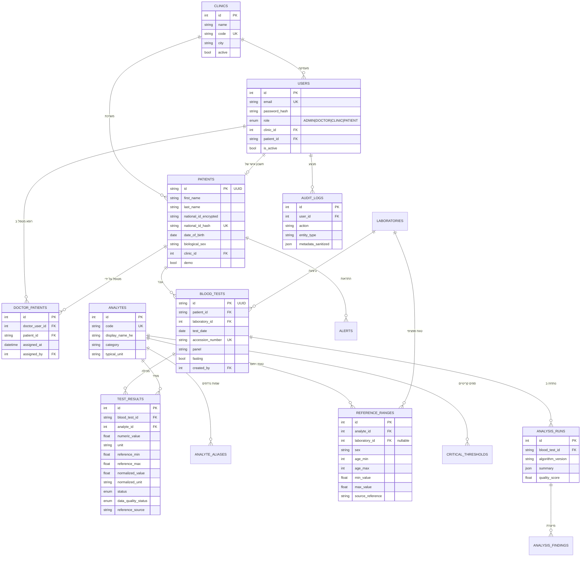

# עיצוב מסד הנתונים — HEMORA

## דיאגרמת ER



## שלוש הטבלאות שמייצרות את מודל ההרשאות

| טבלה | תפקיד |
|---|---|
| `clinics` | ישות המרפאה |
| `patients.clinic_id` | כל מטופל שייך למרפאה אחת — הבסיס להרשאת CLINIC |
| `doctor_patients` | שיוך רבים־לרבים בין רופא למטופל — הבסיס להרשאת DOCTOR |

`doctor_patients` הוא רבים־לרבים בכוונה: למטופל אחד יכולים להיות כמה רופאים
מטפלים, ולרופא אחד יש הרבה מטופלים. יש `UniqueConstraint` על הצמד
`(doctor_user_id, patient_id)` כדי למנוע שיוך כפול.

## החלטות עיצוב

**תעודת זהות נשמרת פעמיים.**
`national_id_encrypted` מוצפן ב-Fernet וניתן לפענוח כדי להציג את הספרות
האחרונות; `national_id_hash` הוא HMAC-SHA256 דטרמיניסטי, מאונדקס וייחודי,
ומשמש לחיפוש ולמניעת כפילויות — בלי לחשוף את הערך. כך אפשר לאתר מטופל לפי
ת״ז מבלי לפענח אף רשומה.

**ערך גולמי וערך מנורמל נשמרים בנפרד.**
`numeric_value` + `unit` הם מה שהמעבדה שלחה, ולעולם לא משתנים.
`normalized_value` + `normalized_unit` הם התוצאה של המרה דטרמיניסטית מאושרת.
השוואות בין בדיקות משתמשות במנורמל; אם אין המרה בטוחה, המערכת מסמנת
`NOT_COMPARABLE` במקום להשוות.

**מקור טווח הייחוס נשמר בשדה.**
`reference_source` מקבל אחד מ-`LAB_SUPPLIED` / `LAB_CONFIG` / `DEMO_GENERAL` / `NONE`,
לפי סדר עדיפויות. כשמוצג טווח `DEMO_GENERAL`, הממשק חייב להציג הודעה
שהטווח כללי ושיש להעדיף את טווח המעבדה.

**ספים קריטיים בטבלה נפרדת.**
`critical_thresholds` נפרדת מ-`reference_ranges` כדי שלא ייווצר סף קריטי
בטעות מטווח ייחוס רגיל. סף נחשב תקף רק אם קיים בו `source_reference` מלא.

**ניתוח נשמר עם גרסה.**
כל `analysis_runs` שומר `algorithm_version`. שינוי עתידי בכללים לא יסתיר
את הבסיס שלפיו ניתנה תוצאה קודמת.

**Audit מסונן בכתיבה.**
`AuditService.record` מסיר מפתחות רגישים (`password`, `token`, `national_id`,
`medical_record`) לפני השמירה — הסינון קורה בשכבת השירות, לא בתצוגה.

## אינדקסים ואילוצים מרכזיים

| אילוץ | מטרה |
|---|---|
| `patients.national_id_hash` UNIQUE | מניעת מטופל כפול |
| `blood_tests.accession_number` UNIQUE | מניעת קליטה כפולה של אותה בדיקה |
| `test_results (blood_test_id, analyte_id)` UNIQUE | מדד לא יופיע פעמיים באותה בדיקה |
| `doctor_patients (doctor_user_id, patient_id)` UNIQUE | מניעת שיוך כפול |
| `analyte_aliases.alias` UNIQUE | מיפוי חד־ערכי בייבוא |
| `ix_results_test_status` | סינון מהיר של תוצאות חריגות |
| אינדקסים על `patients.clinic_id`, `doctor_patients.*` | שאילתות ההרשאות |

## Migrations

הסכימה מנוהלת ב-Alembic (`backend/alembic/`).

```bash
cd backend
alembic upgrade head
python -m app.seed
```

פקודת ה-seed היא idempotent — אם כבר קיימים משתמשים היא יוצאת מיד.
כדי לבנות מחדש נתוני הדגמה: מחקו את `backend/hemora.db` והריצו שוב.
