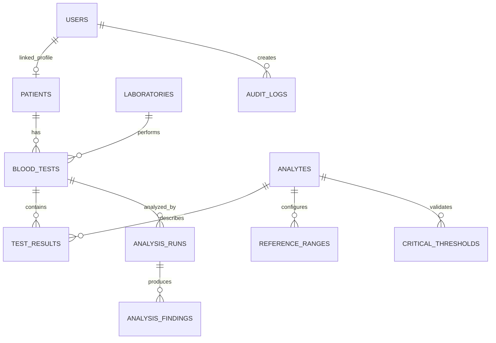

# תכנון מסד הנתונים

המזהים הרפואיים הם UUID. תעודת זהות נשמרת מוצפנת ולצידה HMAC דטרמיניסטי לחיפוש וייחודיות. מפתחות זרים, אילוצי ייחודיות ואינדקסים מגנים על עקביות וביצועים. כל הזמנים נשמרים UTC.
